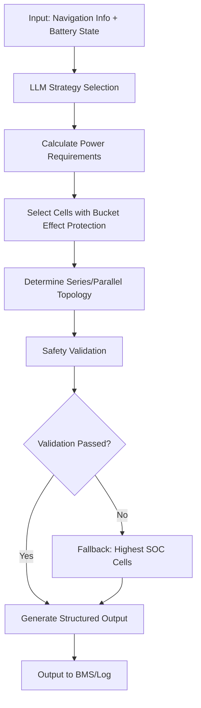

# DRBP Balanced Discharge - LLM-Guided Battery Management

## Overview

This skill enables intelligent management of Dynamic Reconfigurable Battery Packs (DRBP) using Large Language Model (LLM) guidance. The core objective is to achieve **balanced discharge** across all battery cells, ensuring each cell's State of Charge (SOC) approaches zero simultaneously at the end of discharge cycles, while extending battery pack lifetime.

**Key architecture:**
- 20 modules fixed in series
- Each module contains 4×4 cells (16 cells per module)
- Cells within each module can be connected in arbitrary series/parallel configurations
- 10-minute fixed navigation cycles with constant power demand

**Primary goal:** When battery pack discharge completes, every cell's SOC must be close to 0 (balanced discharge).

## Workflow Overview



## Step 1: Input Data Preparation

### Battery State Summary
Extract battery state summary parameters from user prompt

### Navigation Information (via Prompt)
Extract navigation parameters from user prompt


## Step 2: LLM Strategy Selection

Call LLM API with a structured prompt containing:
1. Battery state summary (module-level statistics)
2. Navigation requirements
3. Available strategy definitions (see `references/strategies.md`)

**Expected LLM output format:**
```json
{
  "strategy": "equilibrium",
  "reason": "SOC标准差较大(0.15)，需要快速收敛",
  "parameters": {
    "cells_per_module": 4,
    "priority_weights": {"soc": 0.9, "soh": 0.1}
  }
}
```

**Available strategies:**
1. **High-energy**: Maximize energy output, prioritize high-SOC cells
2. **Equilibrium**: Fast SOC convergence, prioritize highest-SOC cells
3. **Thermal-management**: Control temperature distribution, prioritize high-temperature cells
4. **Lifetime-optimization**: Minimize aging, prioritize low-SOH cells (with safety constraints)

## Step 3: Power Requirement Calculation

- See `references/vehicle_model.md`
- First calculate the required current, then calculate the voltage based on the current and power

**Output:** `v_req` (V) and `i_req` (A) based on:

- Constant power demand
- Vehicle efficiency model
- Battery pack constraints

## Step 4: Cell Selection with Bucket Effect Protection

Execute `scripts/cell_selector.py` with LLM strategy parameters:
```bash
python scripts/cell_selector.py --battery input_file.json --strategy equilibrium --cells_per_module 4 --weights '{"soc": 0.9, "soh": 0.1}'
```

**Bucket effect protection:** The algorithm ensures the weakest selected cell (lowest SOC, highest resistance) can safely discharge for 10 minutes without dropping below minimum SOC threshold (default: 0.05).

**Selection logic:**
1. Calculate composite score for each cell: `score = w1*soc + w2*soh - w3*temperature - w4*resistance`
2. Sort cells within each module by score (descending)
3. Select top `k` cells per module
4. Validate each selected cell can deliver required current for 10 minutes

## Step 5: Topology Determination

**Constraints:**
- 20 modules in series → each module must have identical series/parallel configuration
- Selected cells per module must be divisible into equal series/parallel groups

**Algorithm:**
1. Calculate required series count: `n_series = ceil(v_req / (20 * cell_nominal_voltage))`
2. Calculate required parallel count: `n_parallel = ceil(i_req / (cell_max_current * efficiency))`
3. Find configuration where `n_series × n_parallel ≤ selected_cells_per_module`
4. If multiple configurations possible, choose minimal parallel count (fewer cells)

## Step 6: Fallback Mechanism

If LLM decision fails or safety validation fails:
1. Switch to **deterministic fallback strategy**
2. Select cells with highest SOC in each module
3. Use conservative topology (more parallel connections for current sharing)
4. Log failure reason for analysis


## Step 7: Structured Output Generation

Final output format:
```json
{
  "status": boolean, //电池组是否还能运行
  "v_req": float, //需求电压
  "i_req": float, //需求电流
  "selected_cells": [
    {
      "mod_id": 0,
      "cells": [[...], [...]]  // 每一个子列表为一个并联支路
    },
    // ... 19 more modules
  ],
  "reason": ""  // 选择理由
}
```

## File References

- **Battery architecture details**: See `references/architecture.md`
- **Strategy definitions**: See `references/strategies.md`
- **Vehicle model parameters**: See `references/vehicle_model.md`
- **Safety constraints**: See `references/safety_constraints.md`
- **LLM prompt templates**: See `references/llm_prompts.md`

## Important Notes

1. **Ultimate goal**: All cells must approach SOC=0 simultaneously at discharge completion
2. **Bucket effect**: Always verify weakest cell can meet 10-minute discharge requirement
3. **Fallback reliability**: Highest-SOC fallback must always produce valid configuration

---

**Remember the primary objective**: When battery pack discharge ends, every cell's SOC should be close to 0. All decisions must prioritize this balanced discharge goal.
